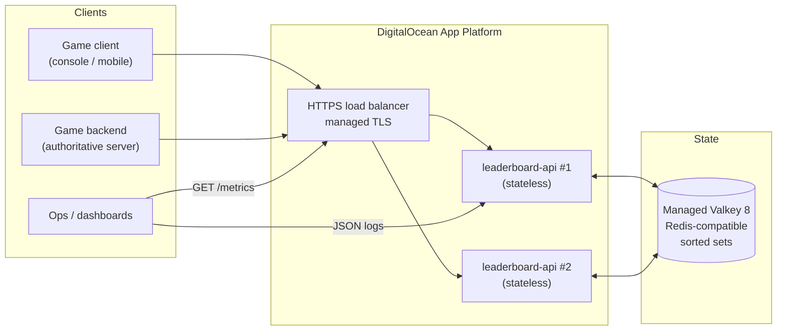
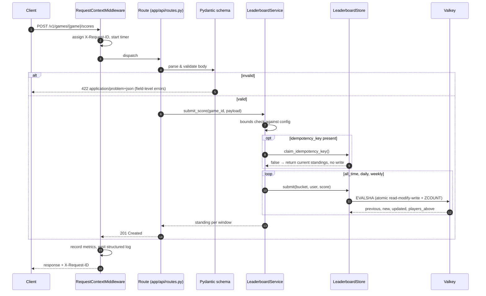
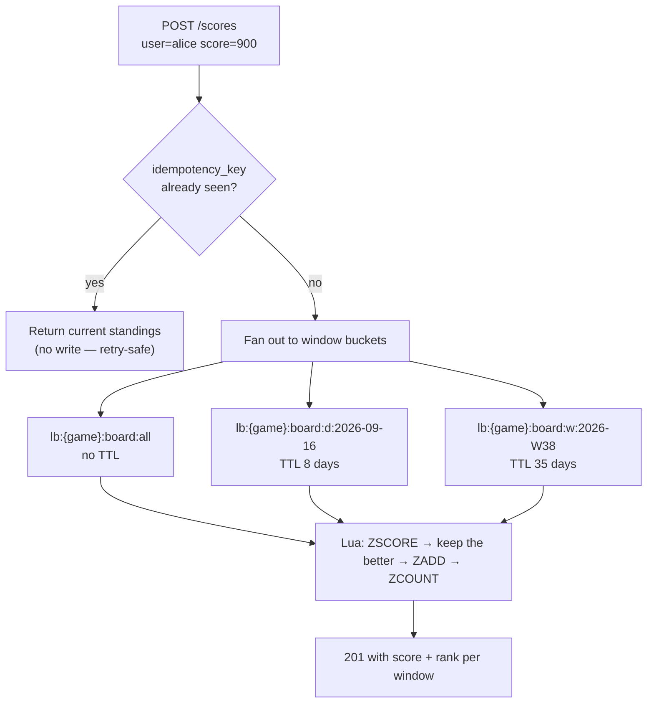
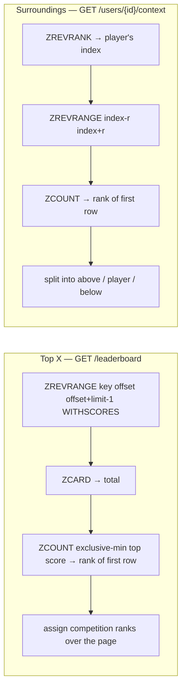
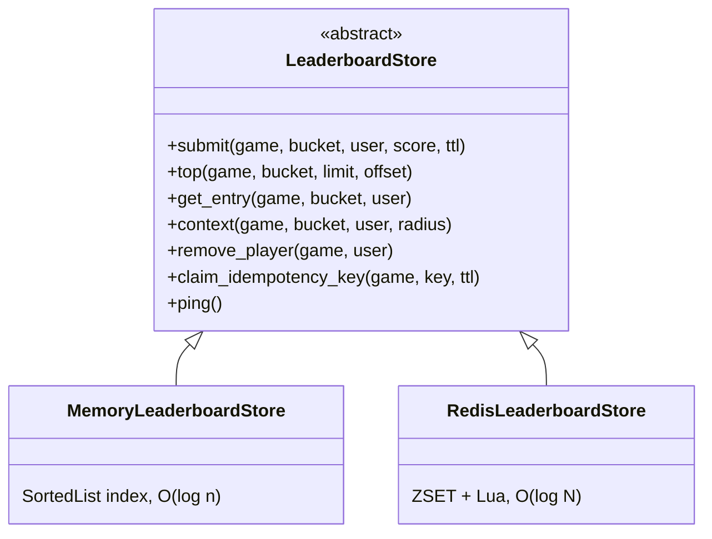
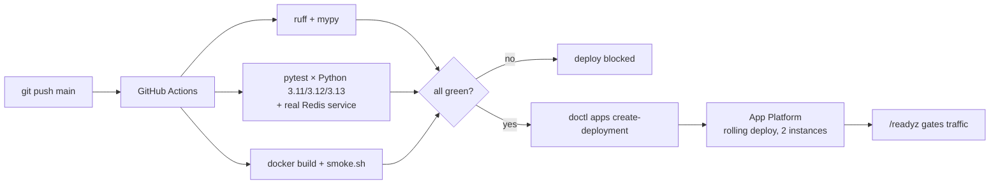

# Architecture

> **A note on naming.** DigitalOcean has replaced its managed Redis product with
> **Valkey**, the Redis fork, and Valkey 8 is what is deployed here. Valkey
> speaks the Redis wire protocol and the same commands, so the client library
> is `redis-py`, the config key is `LEADERBOARD_REDIS_URL`, and `/readyz`
> reports `backend: "redis"`. Throughout this document **"Redis" refers to the
> protocol and data structures**; **"Valkey" refers to the specific managed
> service** running them.

## 1. System context

The API tier holds **no state**. Every fact about a leaderboard lives in Redis,
which is what makes the instance count a pure capacity decision rather than a
correctness one.

## 2. Request lifecycle

Every request travels the same path. Layers are strictly ordered, and each one
has exactly one job.

**Why the layering matters:** routes never touch Redis, the service never
formats HTTP, and the store never knows what a "window" is. Each concern can be
tested — and replaced — on its own.

## 3. Data flow: one write, three boards

A single submission fans out to every time window, so the client makes one call
and the product gets daily/weekly/all-time boards for free.

Rolling windows carry a TTL, so storage is bounded by *active* games rather than
by all history. All-time never expires.

## 4. Read paths

No read ever loads the whole board. The cost of every operation is
`O(log N + page_size)`.

| Operation | Redis commands | Complexity |
|---|---|---|
| Submit a score | `EVALSHA` (`ZSCORE`+`ZADD`+`ZCOUNT`) | `O(log N)` |
| Top X | `ZREVRANGE` + `ZCARD` + `ZCOUNT` | `O(log N + X)` |
| A player's rank | `ZSCORE` + `ZCOUNT` | `O(log N)` |
| A player's surroundings | `ZREVRANK` + `ZREVRANGE` + `ZCOUNT` | `O(log N + radius)` |
| Erase a player | `SMEMBERS` + `ZREM` per bucket | `O(buckets · log N)` |

## 5. Key design decisions

### 5.1 Redis sorted sets as the primary store

A leaderboard is a ranked set with hot reads and hot writes — precisely the
ZSET access pattern. The alternative, a relational table with
`ORDER BY score DESC`, needs either a full sort or a covering index plus a
window function to produce a rank, and neither degrades gracefully at millions
of rows with writes arriving continuously.

**Trade-off accepted:** Redis is memory-resident, so cost scales with player
count, and durability is weaker than a relational database. For leaderboard
data — reconstructible from the game's own event history — that is the right
side of the trade.

### 5.2 One scoring rule: the best score stands

The API takes a score and keeps the higher of it and what is already on record.
An API that additionally offered `absolute` (overwrite) and `increment`
(accumulate) modes was considered and rejected. Three ways to mutate a score is
three sets of edge cases in the store, in validation and in the tests, and
neither extra mode is required to rank players by score.

The single rule buys a property worth having — the write is **commutative and
idempotent**. Submissions can arrive out of order, or twice, and the board
converges to the same answer. That is what makes retries safe and what keeps
the Lua script short enough to read in one sitting.

**Trade-off accepted:** accumulating seasons and battle passes want
`increment`, and an authoritative correction from the game server wants
`absolute`. Both would be additive changes to `submit()` behind a request
field; neither is needed to rank players by score.

### 5.3 Competition ranking, computed rather than stored

Rank is **derived** on read (`ZCOUNT` of strictly-higher scores, plus one),
never persisted. Storing a rank column would mean updating up to `N` rows on
every submission.

Ties **share** the better rank and the next distinct score skips ahead — `1, 2,
2, 4`, not `1, 2, 2, 3`. This is what players expect from a scoreboard, and it
means a player's rank cannot change just because someone else tied them.

### 5.4 Deterministic tie ordering

Within equal scores, entries are ordered by **descending user id**. The choice
is arbitrary; the *determinism* is not. An unstable intra-tie order lets a
player appear on two consecutive pages, or on neither, as a client paginates.
The in-memory backend reproduces Redis's reverse-lexicographic ordering exactly
so the two backends are interchangeable.

### 5.5 Atomic read-modify-write in Lua

Keeping a player's best score is a compare-and-set. Doing it as client-side
`ZSCORE` then `ZADD` is a lost-update race: two submissions for the same player
interleave and the higher score can be overwritten by the lower one. The Lua
script makes it atomic server-side and collapses four round trips into one.
`test_concurrent_submissions_do_not_lose_the_winning_score` fires five
concurrent submissions and asserts the maximum survives.

> Redis's `ZADD ... GT` would handle the comparison on its own, but it reports
> neither the previous score nor the resulting rank, and the API returns both.
> The script is one round trip for all three answers.

### 5.6 A pluggable store, and why there are two

The in-memory backend is **not** a mock. It is a real ordered index with the
same complexity profile, which buys three things: `pytest` runs on a clean
laptop with no daemon, CI needs no service orchestration for most of the suite,
and the abstraction is proven to be a real seam rather than a Redis-shaped hole.

Both backends are held to **one shared conformance suite**
(`tests/test_store_conformance.py`), so they cannot drift apart in ranking,
tie-breaking or score semantics without a test failing.

**Trade-off accepted:** the memory backend must never be used in production —
state is per-process, so it survives neither a restart nor a second replica.
That is enforced by configuration defaults, not by hope: production sets
`LEADERBOARD_STORE_BACKEND=redis`, and `/readyz` reports which backend is live.

### 5.7 Idempotent submissions

Mobile clients retry, and queues redeliver. Best-score semantics already make
an identical retry harmless, so the key earns its place on the cases that rule
does not cover: a retry whose payload has drifted, or a redelivery that would
otherwise land a second, different write. The key is claimed with `SET NX EX`;
a replay returns the player's current standing with `deduplicated: true` and
performs no write at all.

**Trade-off accepted:** this is a TTL-bounded guard (1 day), not a durable
exactly-once log. A replay arriving after the window applies normally — which
for a leaderboard is harmless, because the scoring rule is itself idempotent.

### 5.8 Redis Cluster readiness

Keys are namespaced `lb:{game}:...`. The braces are a Redis Cluster **hash
tag**: every key for one game hashes to the same slot, so multi-key scripts stay
legal if this is ever moved onto a clustered deployment. Sharding by game is
also the natural partition — no query spans two games.

## 6. Failure behaviour

| Failure | Behaviour | Rationale |
|---|---|---|
| Redis unreachable | `503` with `problem+json`; `/readyz` goes red; `/healthz` stays green | The pod is alive — restarting it will not fix Redis. Readiness pulls it out of rotation instead. |
| Malformed body | `422` with per-field errors | A client cannot fix what it cannot see. |
| Unknown player | `404` | Distinguishable from an empty board. |
| Empty board | `200` with `entries: []` | An empty leaderboard is a valid state, not an error. |
| Unhandled exception | `500`, details logged, never echoed | Internals are not a client's business. |
| Redis timeout | Bounded by `socket_timeout` (2 s) | A slow dependency must not become an unbounded queue. |

## 7. Deployment

Health checks target `/readyz`, which fails when Redis is unreachable — so a
broken instance never receives traffic during a rollout.

App Platform's own `deploy_on_push` is switched off on purpose: it triggers the
moment a commit lands, concurrently with CI, which would let a failing commit
reach production. CI is the only path that can deploy.

## 8. Scaling path

Roughly where each bottleneck appears, and what to do about it.

| Scale | Bottleneck | Response |
|---|---|---|
| ~1k rps | none | 2 instances, single Redis |
| ~10k rps | API CPU | scale out to ~6 instances; CPU autoscaling needs a dedicated slug, spec'd inline |
| ~50k rps reads | Redis CPU | add Redis read replicas; serve `top` from replicas, keep writes on the primary |
| Hot top-10 | repeated identical reads | cache the first page for 1–2 s; the board is a leaderboard, not a ledger |
| Millions of players/game | single-node memory | shard by `game_id` (hash tags already permit it) |
| Write bursts at event start | Redis write throughput | buffer submissions through a queue and pipeline `ZADD`s, trading freshness for throughput |

## 9. What was deliberately left out

Scope decisions, not oversights:

- **Authentication.** In production this sits behind the game's authoritative
  backend, which already knows the player. A public write endpoint would need
  service-to-service auth (mTLS or signed tokens) before it saw real traffic.
- **Anti-cheat.** Score validation beyond range checking needs game-specific
  context — replay verification, rate-of-gain heuristics. The `DELETE` endpoint
  exists so a takedown has a supported path.
- **Per-client rate limiting.** Belongs at the edge; App Platform and Cloudflare
  both do it better than an in-process limiter that resets on every deploy.
- **Score history.** Only the current standing is kept. "Show me my progress
  over the season" wants an append-only event log alongside the ZSET.
- **Real-time push.** A WebSocket channel for live rank changes is the obvious
  next feature; polling `GET /context` covers it for now.
